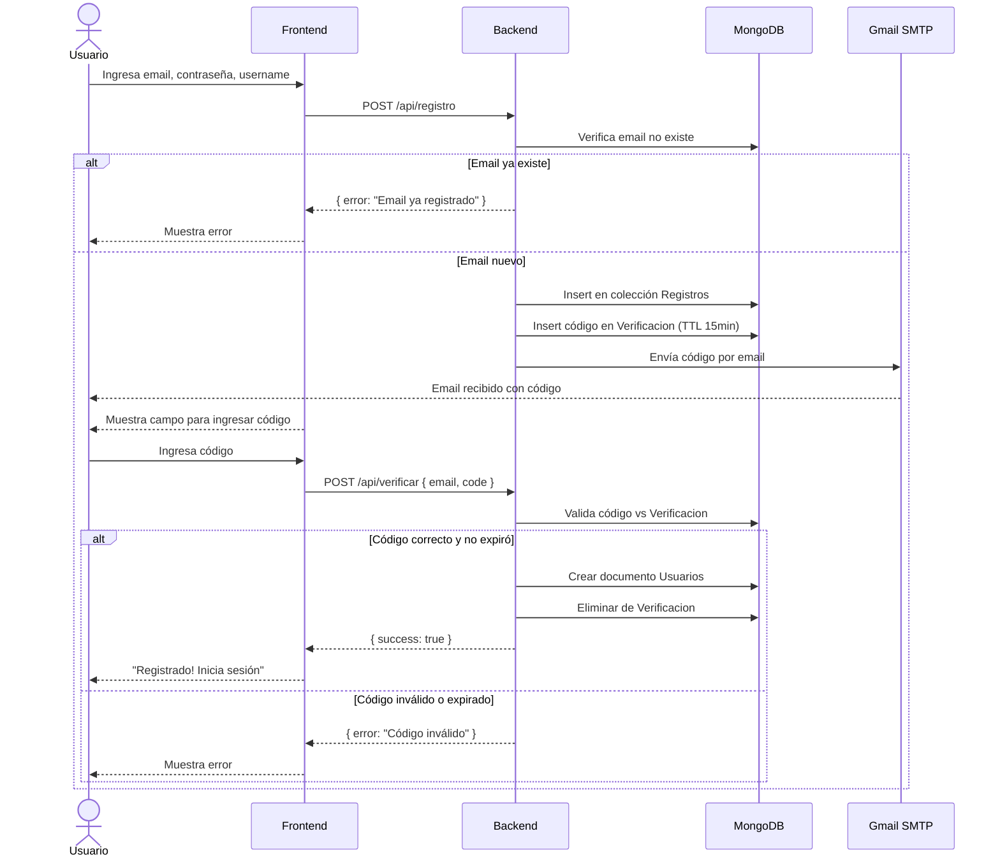
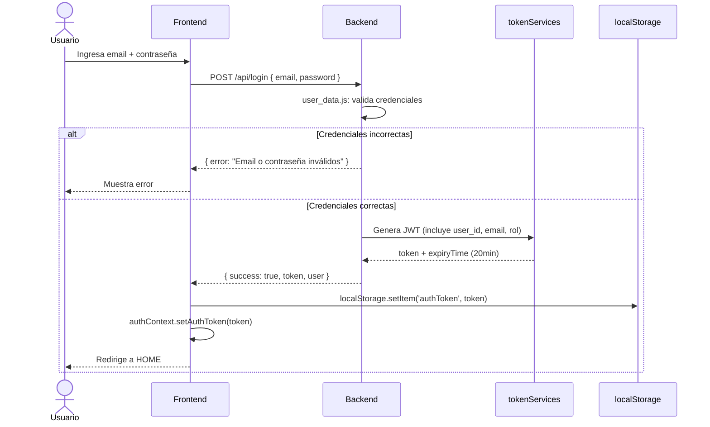
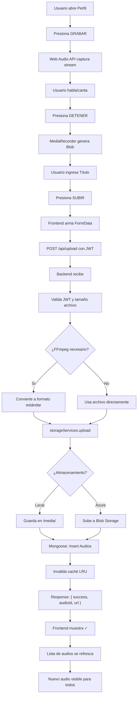
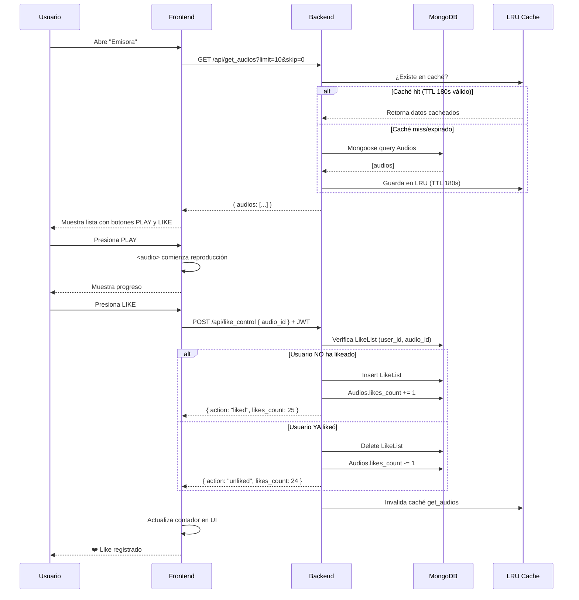
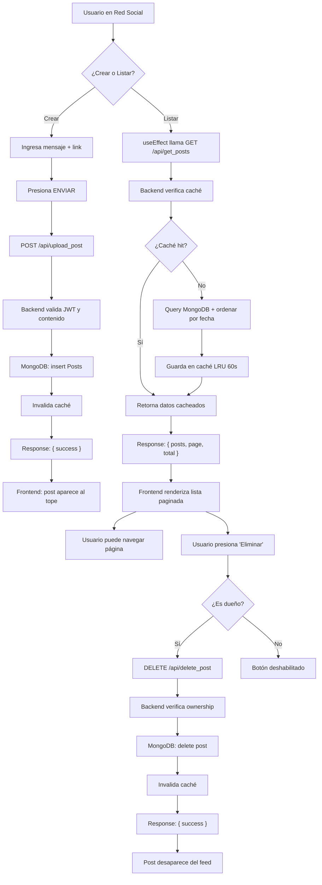
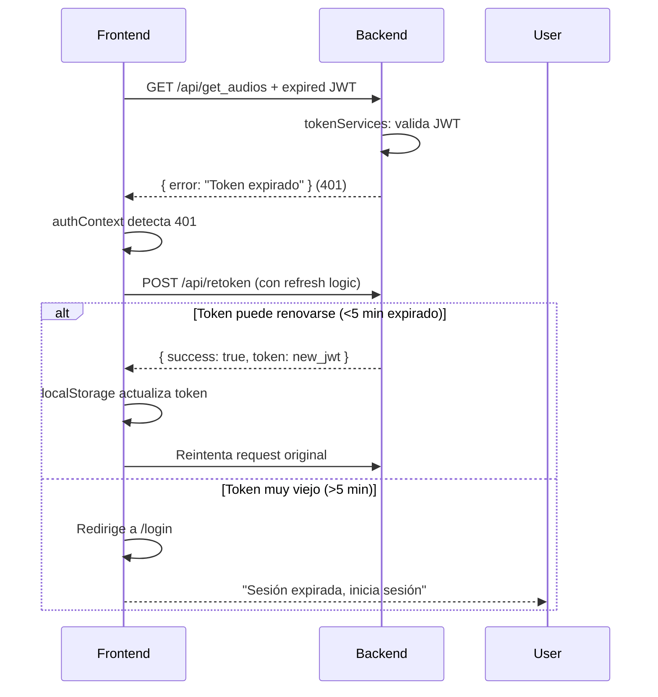

# Workflows de ChazaRadio

Diagramas de flujo detallados para los procesos principales de la aplicación.

---

## 1️⃣ Flujo de Autenticación

```
┌─────────────────────────────────────────────────────────────────┐
│                    REGISTRO Y VERIFICACIÓN                       │
└─────────────────────────────────────────────────────────────────┘

Frontend: register.tsx
│
├─ Usuario ingresa: email + contraseña + username
│
├─ POST /api/registro
│  │
│  └─ Backend: user_data.js
│     ├─ Validar email no existe
│     ├─ Validar formato contraseña
│     ├─ Crear documento en colección Registros (sin verificar)
│     ├─ Generar código 6 dígitos
│     ├─ Insertar en Verificacion { email, code, expiry: +15min }
│     ├─ Enviar email vía mail_sender.js (Nodemailer)
│     └─ Response: { success: true, mensaje: "Verifica tu email" }
│
├─ Frontend muestra formulario verificación
│
├─ Usuario ingresa código
│
├─ POST /api/verificar
│  │
│  └─ Backend: user_data.js
│     ├─ Validar código existe y no expiró
│     ├─ Si válido:
│     │  ├─ Crear documento en Usuarios
│     │  ├─ Eliminar de Verificacion
│     │  └─ Response: { success: true }
│     └─ Si inválido:
│        └─ Response: { error: "Código inválido o expirado" }
│
└─ Frontend redirige a LOGIN
```

### Diagrama Mermaid - Registro



### Diagrama Mermaid - Login



---

## 2️⃣ Flujo de Carga de Audio

```
┌─────────────────────────────────────────────────────────────────┐
│                  GRABACIÓN Y CARGA DE AUDIO                      │
└─────────────────────────────────────────────────────────────────┘

Frontend: perfil.tsx + recorder.tsx
│
├─ Usuario abre sección "Grabar"
│
├─ Componente recorder.tsx inicializa Web Audio API
│  ├─ Solicita permiso de micrófono
│  └─ Estado: "Listo para grabar"
│
├─ Usuario presiona GRABAR
│  ├─ MediaRecorder captura audio stream
│  └─ Muestra timer de grabación
│
├─ Usuario presiona DETENER
│  ├─ MediaRecorder genera Blob (audio/wav o audio/webm)
│  └─ Guarda en estado local
│
├─ Usuario ingresa título y presiona SUBIR
│
├─ Frontend arma FormData:
│  ├─ archivo: Blob de audio
│  ├─ titulo: string
│  └─ metadata: { formato: 'webm', duracion: 120s, ... }
│
├─ POST /api/upload (con JWT header)
│  │
│  └─ Backend: upload.js
│     ├─ Middleware: valida JWT
│     ├─ Middleware: multer captura archivo → /tmp/
│     ├─ Validar tamaño (<50MB recomendado)
│     ├─ FFmpeg (opcional): convierte a MP3/formato estándar
│     ├─ storageServices.upload():
│     │  ├─ Si LOCAL: mueve a /media/audio_<timestamp>.webm
│     │  └─ Si AZURE: sube a Blob Storage → obtiene URL
│     ├─ Mongoose: inserta en colección Audios
│     │  └─ { titulo, url, autor: user_id, likes_count: 0, fecha: now, ... }
│     ├─ Invalida caché (LRU get_audios)
│     └─ Response: { success: true, audioId, url, titulo }
│
├─ Frontend recibe respuesta
│  ├─ Limpia estado (borra grabación local)
│  ├─ Muestra "✓ Audio subido exitosamente"
│  └─ Refresca lista de audios
│
└─ Nuevo audio aparece en "Emisora" para todos los usuarios
```

### Diagrama Mermaid



---

## 3️⃣ Flujo de Reproducción y Likes

```
┌─────────────────────────────────────────────────────────────────┐
│                 REPRODUCCIÓN Y SISTEMA DE LIKES                  │
└─────────────────────────────────────────────────────────────────┘

Frontend: emisora_main.tsx + lista.tsx
│
├─ Usuario abre sección "Emisora"
│
├─ componente lista.tsx monta
│  ├─ efectoCall: GET /api/get_audios?limit=10&skip=0
│  └─ cacheServices en Backend: retorna (180s TTL)
│
├─ Backend: audio_data.js
│  ├─ Verifica caché LRU
│  ├─ Si CACHE HIT: retorna datos cached
│  ├─ Si CACHE MISS:
│  │  ├─ Mongoose query: Audios.find().limit(10)
│  │  ├─ Guarda en caché
│  │  └─ Retorna datos
│  └─ Response: [{ id, titulo, url, autor, likes_count, ... }]
│
├─ Frontend muestra lista con:
│  ├─ Nombre del audio
│  ├─ Botón PLAY (HTML5 <audio>)
│  ├─ Contador de likes
│  └─ Botón LIKE/UNLIKE
│
├─ Usuario presiona PLAY
│  ├─ HTML5 <audio> reproduce desde URL
│  ├─ Muestra progreso/duración
│  └─ Usuario puede pausar, cambiar volumen, etc.
│
├─ Usuario presiona LIKE
│
├─ POST /api/like_control (con JWT)
│  │
│  └─ Backend: like_control.js
│     ├─ Valida JWT (obtiene user_id)
│     ├─ Verifica si usuario ya likeó este audio
│     ├─ Si NO likeó:
│     │  ├─ Insertar en LikeList { user_id, audio_id }
│     │  ├─ Incrementar Audios.likes_count
│     │  └─ Responde: { action: "liked", likes_count: 25 }
│     └─ Si YA likeó:
│        ├─ Eliminar de LikeList
│        ├─ Decrementar Audios.likes_count
│        └─ Responde: { action: "unliked", likes_count: 24 }
│     ├─ Invalida caché
│     └─ Response: { success, action, likes_count }
│
├─ Frontend recibe
│  ├─ Actualiza botón (LIKE → UNLIKE o viceversa)
│  └─ Actualiza contador dinámicamente
│
└─ Experiencia: usuario ve likes subiendo en tiempo real (pseudo-realtime via UI)
```

### Diagrama Mermaid



---

## 4️⃣ Flujo de Feed Social (Posts)

```
┌─────────────────────────────────────────────────────────────────┐
│                    FEED SOCIAL - CREAR Y LISTAR                  │
└─────────────────────────────────────────────────────────────────┘

### CREAR POST

Frontend: red_social.tsx
│
├─ Usuario ingresa mensaje (max 500 caracteres)
├─ Usuario (opcional) ingresa link
│
├─ POST /api/upload_post (con JWT)
│  │
│  └─ Backend: upload_post.js
│     ├─ Valida JWT
│     ├─ Valida contenido no esté vacío
│     ├─ Mongoose: inserta en Posts
│     │  └─ { contenido, link, autor: user_id, fecha: now, likes: 0 }
│     ├─ Invalida caché (get_posts)
│     └─ Response: { success: true, postId, post }
│
├─ Frontend actualiza lista
│
└─ Nuevo post aparece al tope del feed

### LISTAR POSTS (CON PAGINACIÓN)

Frontend: red_social.tsx
│
├─ useEffect: GET /api/get_posts?page=1&limit=10
│
├─ Backend: upload_post.js
│  ├─ Verifica caché LRU (60s TTL)
│  ├─ Si CACHE MISS:
│  │  ├─ Mongoose: Posts.find().skip(page*10).limit(10).sort({fecha: -1})
│  │  ├─ Guarda en caché
│  │  └─ Retorna posts con datos de autor (nombre, avatar)
│  ├─ Response: { posts: [...], total, page }
│
├─ Frontend renderiza lista paginada
│  ├─ Muestra cada post con:
│  │  ├─ Autor
│  │  ├─ Contenido
│  │  ├─ Link (si existe)
│  │  └─ Fecha
│  └─ Botón SIGUIENTE si hay más posts
│
└─ Usuario puede:
   ├─ Hacer click en link (abre en nueva pestaña)
   └─ Eliminar si es dueño del post

### ELIMINAR POST (SOLO DUEÑO)

Frontend: red_social.tsx
│
├─ Usuario presiona botón "Eliminar"
│
├─ DELETE /api/delete_post/:postId (con JWT)
│  │
│  └─ Backend: upload_post.js
│     ├─ Valida JWT
│     ├─ Verifica que user_id == post.autor
│     ├─ Si es dueño:
│     │  ├─ MongoDB: delete post
│     │  ├─ Invalida caché
│     │  └─ Response: { success: true }
│     └─ Si NO es dueño:
│        └─ Response: { error: "No autorizado" } (403)
│
├─ Frontend recibe
│
└─ Refresca lista (post desaparece)
```

### Diagrama Mermaid



---

## 5️⃣ Flujo de Podcasts

```
┌─────────────────────────────────────────────────────────────────┐
│            GESTIÓN DE SERIES DE PODCASTS                         │
└─────────────────────────────────────────────────────────────────┘

Frontend: (componente específico no documentado, ver poadcast_data.js)
│
├─ Usuario (creador) crea serie de podcast
│  ├─ Ingresa: nombre, descripción, imagen
│  └─ Agrega episodios (URL de audio)
│
├─ POST /api/upload_poadcast (con JWT)
│  │
│  └─ Backend: poadcast_data.js
│     ├─ Valida JWT
│     ├─ Valida creador y datos
│     ├─ Mongoose: MongoDB.findOneAndUpdate (upsert)
│     │  └─ Crea o actualiza documento Poadcasts
│     ├─ Campos: { titulo, descripcion, creador: user_id, episodios: [...] }
│     ├─ Invalida caché
│     └─ Response: { success: true, poadcastId }
│
└─ Backend: poadcast_data.js: GET /api/get_poadcast
   ├─ Verifica caché
   ├─ Retorna todas las series
   ├─ Frontend renderiza lista
   └─ Usuario puede:
      ├─ Reproducir episodios
      ├─ Ver descripción
      └─ Editar si es creador (future: no implementado)
```

---

## 🔄 Manejo de Errores Comunes

### 1. Token Expirado



### 2. Archivo Demasiado Grande

```
Usuario sube audio > 50MB
│
├─ Frontend: archivo muy grande (validación lado cliente)
│
├─ Backend: multer rechaza si > configuración
│
└─ Response: { error: "Archivo excede límite" } (413)
   └─ Frontend muestra error al usuario
```

### 3. Base de Datos No Disponible

```
Backend intenta conectar MongoDB
│
├─ Si falla: conector.js log error
├─ Response: { error: "Servidor no disponible" } (500)
└─ Frontend muestra: "Error temporal, intenta más tarde"
```

---

## 📊 Matriz de Endpoints

| Operación | Método | Endpoint | Protegido | Cache |
|-----------|--------|----------|-----------|-------|
| Crear usuario | POST | /api/registro | No | No |
| Verificar email | POST | /api/verificar | No | No |
| Iniciar sesión | POST | /api/login | No | No |
| Renovar token | GET | /api/retoken | Sí | No |
| Listar audios | GET | /api/get_audios | No | 180s |
| Subir audio | POST | /api/upload | Sí | N/A |
| Eliminar audio | DELETE | /api/delete_audio/:id | Sí | N/A |
| Dar/quitar like | POST | /api/like_control | Sí | N/A |
| Listar likes | GET | /api/get_likeList | Sí | 60s |
| Crear post | POST | /api/upload_post | Sí | N/A |
| Listar posts | GET | /api/get_posts | No | 60s |
| Eliminar post | DELETE | /api/delete_post/:id | Sí | N/A |
| Crear podcast | POST | /api/upload_poadcast | Sí | N/A |
| Listar podcasts | GET | /api/get_poadcast | No | 180s |

---

## 🎯 Resumen

- **Autenticación**: Verificación email → JWT 20min → Auto-renew
- **Audios**: Grab vía Web Audio API → Upload → Storage → Reproducción + Likes
- **Social**: Posts → Paginación → Eliminación si dueño
- **Podcasts**: Series con episodios → Listable para todos
- **Caché**: LRU en backend, TTL 60-180s para optimizar BD
- **Errores**: Manejo de token expirado, archivo grande, DB offline

